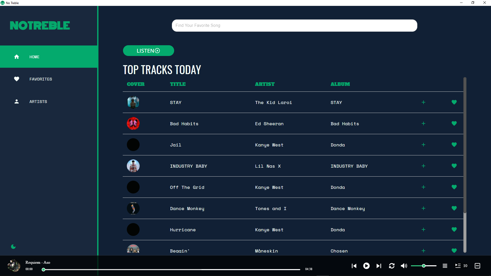
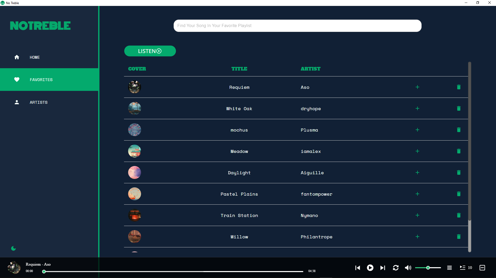
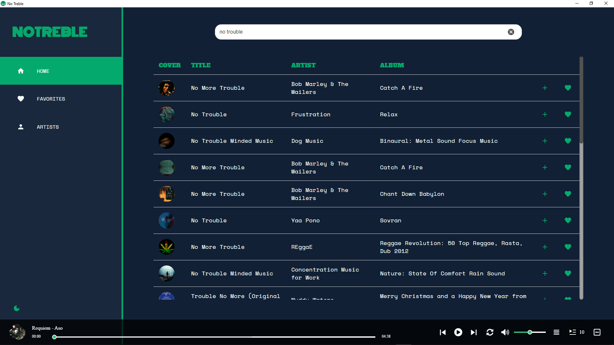
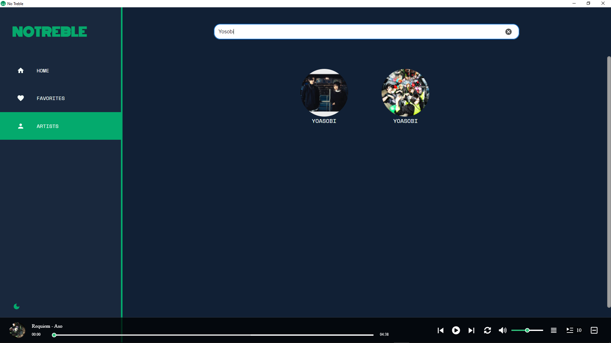
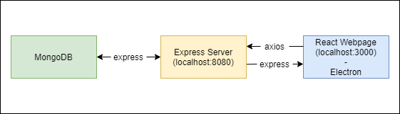

 
 
  
  
  
  <h1>NoTreble 🎧🎼</h1>
  
Allows users to access Deezer api to queue and play songs.

  
 Please visit https://no-treble-23672.web.app/ for a live demo of this website.

  
<b>Note:</b> Due to Deezer's api limitations, you are only able to play a 30s preview of a song.

# Getting started
You can get the fully built windows desktop app by going to our [Latest Release](https://github.com/DataFreq/No-Treble/releases) page. If that is not your style you can build the [electron app](https://github.com/DataFreq/No-Treble/tree/master/electron) or host the [webserver](https://github.com/DataFreq/No-Treble/tree/master/web_app) yourself.

### Building the Electron app
- `cd No-Treble/electron`
- Create an `.env` and paste the link to a MongoDB database.
- Create a `music` collection in a `music` MongoDB database and seed the collection with the data from [/electron/src/mongoDB/dummyData.json](https://github.com/DataFreq/No-Treble/blob/master/electron/src/mongoDB/dummyData.json)
- Run `npm i` to install dependencies.
- Run `npm run make` to compile the electron application.
- The complied app will be at /out/no-treble-win32-x64/no-treble.exe

### Running the web application
- `cd No-Treble/web_app`
- Create an `.env` and paste the link to a MongoDB database.
- Create a `music` collection in a `music` MongoDB database and seed the collection with the data from [/electron/src/mongoDB/dummyData.json](https://github.com/DataFreq/No-Treble/blob/master/electron/src/mongoDB/dummyData.json)
- Run `npm i` to install dependencies.
- Run `npm run dev` to start the server and client.
#
## Screenshots

# Architecture

### Internal Architecture

NoTreble is made up of 3 modules, the server, client and cloud database. Starting from the server it connects to the database hosted on MongoDB and makes the data available to the client. The client then connects to the Deezer API which exposes search and play functionality for songs and artists.

### Development

Originally NoTreble's development started with [Electron-Forge](https://www.electronforge.io/) and React but too many issues came up during development.
Eventually NoTreble's development team restarted by using [simple-react-full-stack](https://github.com/crsandeep/simple-react-full-stack) as a boilerplate. After development of the web application was finished, NoTreble was ported over to [Electron](https://www.electronjs.org/) using [Electron-Forge](https://www.electronforge.io/).
